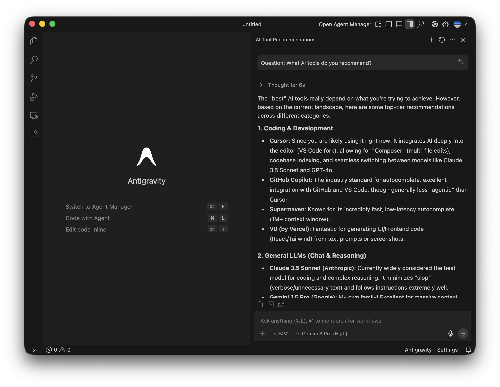
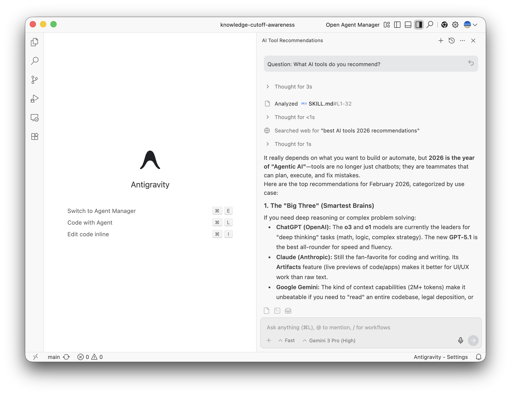

# Knowledge Cutoff Awareness

> An Agent Skill for **Google Antigravity IDE** and **Gemini CLI**.

A lightweight skill set to give AI agents "current time awareness".

## Features
- **Cross-Platform Support**: Works consistently on macOS, Linux, and Windows using a Node.js-based script.
- **Unified Date Calculation**: Provides simple syntax for date manipulation (e.g., `+1d`, `-1w`) across all operating systems.
- **Agent Optimization**: Helps LLMs accurately grasp the current system time, mitigating knowledge cutoff limitations.
- **Simple Integration**: Just place it under `.agent/skills` and it's ready to use.

## Installation

### Via Gemini CLI
If you are using Gemini CLI, you can install this skill directly using the built-in command:

```bash
# Install to the workspace scope (current project)
gemini skills install https://github.com/imkohenauser/knowledge-cutoff-awareness.git --scope workspace

# Or install globally (user scope) to use it across all projects
gemini skills install https://github.com/imkohenauser/knowledge-cutoff-awareness.git
```

### Via npm (Recommended)

Run the following commands in your project's root directory:

```bash
npm install git+https://github.com/imkohenauser/knowledge-cutoff-awareness.git
npx knowledge-cutoff-awareness-install
```

This will install the skill into `.agent/skills/knowledge-cutoff-awareness`.

### Via Git Clone

You can also clone the repository directly into your skills directory:

```bash
mkdir -p .agent/skills
git clone https://github.com/imkohenauser/knowledge-cutoff-awareness.git .agent/skills/knowledge-cutoff-awareness
```

## Usage

Once installed, the agent will automatically recognize this skill (if the `.agent/skills` path is configured).
See [SKILL.md](./.agent/skills/knowledge-cutoff-awareness/SKILL.md) for details.

## Performance

Does it actually help? Yes. We tested the impact of this skill on an AI agent's ability to answer questions about the latest AI tools (as of Feb 2026).

### Without KCA
The agent relied on outdated training data.

<p align="center">
  
  <br>
  <em>(No KCA, Model: Gemini 3 Pro High)</em>
</p>

### With KCA
The agent recognized the date, performed a web search, and provided accurate, up-to-date recommendations.

<p align="center">
  
  <br>
  <em>(With KCA, Model: Gemini 3 Pro High)</em>
</p>

See the full [Performance Test Results](./performance/20260215_ai_tool_questions/README.md).

## Agent Skills

This project is an **Agent Skill**. Skills are an open standard for extending agent capabilities. A skill is a folder containing a `SKILL.md` file with instructions that the agent can follow when working on specific tasks.

References:
- https://agentskills.io/home
- https://antigravity.google/docs/skills
- https://geminicli.com/docs/cli/creating-skills/

## License

This project is licensed under the MIT License - see the [LICENSE](LICENSE) file for details.
