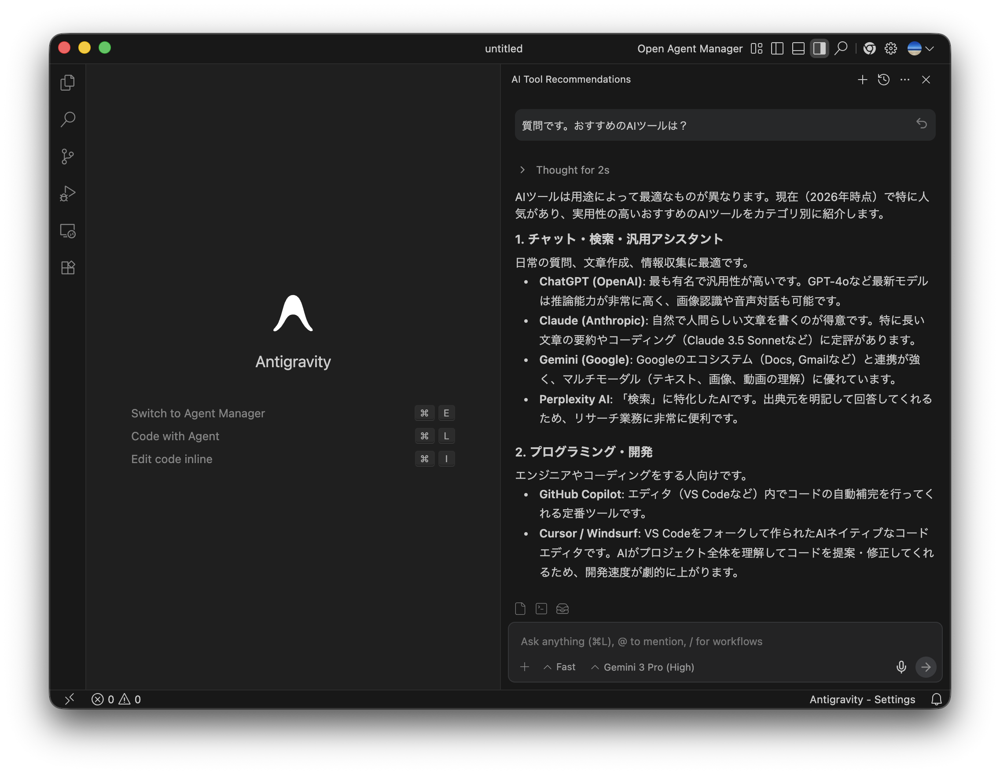

# Performance Test — JA / Default (No KCA)

  
   
  <em>(No KCA, Model: Gemini 3 Pro High)</em>

## User Input

> 質問です。おすすめのAIツールは？

## Reasoning (Gemini 3 Pro High)

### Step 1: Considering AI Tools Recommendations (2s)

I'm currently compiling a list of helpful AI tools in response to a Japanese language inquiry. I'm focusing on diverse categories like coding, but I aim to include tools with general application as well. I'm prioritizing popular and useful options.

### Step 2: Categorizing Helpful AI Tools

I've refined the categorization of helpful AI tools for the Japanese language inquiry. My focus is now on four main categories: Chat/Search, Coding, Creative, and Productivity. I plan to mention ChatGPT, Claude, Gemini, GitHub Copilot, Cursor, Midjourney, Stable Diffusion, DALL-E 3, Notion AI, Perplexity, Suno, and Runway, including Gemini. I am prioritizing a comprehensive response and will ensure to present these in Japanese, structured for clarity.

## Final Output

AIツールは用途によって最適なものが異なります。現在（2026年時点）で特に人気があり、実用性の高いおすすめのAIツールをカテゴリ別に紹介します。

1. チャット・検索・汎用アシスタント

日常の質問、文章作成、情報収集に最適です。

- ChatGPT (OpenAI): 最も有名で汎用性が高いです。GPT-4oなど最新モデルは推論能力が非常に高く、画像認識や音声対話も可能です。
- Claude (Anthropic): 自然で人間らしい文章を書くのが得意です。特に長い文章の要約やコーディング（Claude 3.5 Sonnetなど）に定評があります。
- Gemini (Google): Googleのエコシステム（Docs, Gmailなど）と連携が強く、マルチモーダル（テキスト、画像、動画の理解）に優れています。
- Perplexity AI: 「検索」に特化したAIです。出典元を明記して回答してくれるため、リサーチ業務に非常に便利です。

2. プログラミング・開発

エンジニアやコーディングをする人向けです。

- GitHub Copilot: エディタ（VS Codeなど）内でコードの自動補完を行ってくれる定番ツールです。
- Cursor / Windsurf: VS Codeをフォークして作られたAIネイティブなコードエディタです。AIがプロジェクト全体を理解してコードを提案・修正してくれるため、開発速度が劇的に上がります。

3. 画像・動画・クリエイティブ

- Midjourney: 非常に芸術的で高品質な画像を生成できます。Discord上で操作するのが特徴です。
- Stable Diffusion: ローカル環境でも動作可能な画像生成AI。カスタマイズ性が高く、特定のキャラクターや画風を学習させることも可能です。
- Runway (Gen-2 / Gen-3): テキストや画像から動画を生成・編集できるプロ向けの動画AIツールです。

4. 業務効率化・ドキュメント

- Notion AI: メモアプリNotionに統合されており、議事録の要約、翻訳、アイデア出しなどをドキュメント内で行えます。
- Gamma: パワーポイントなどのスライド資料を、テキストの指示だけで一瞬で作成してくれるツールです。

具体的にどのような作業（例：プログラミング、ブログ執筆、画像作成、リサーチなど）に使いたいか教えていただければ、より詳しくおすすめを紹介できます。